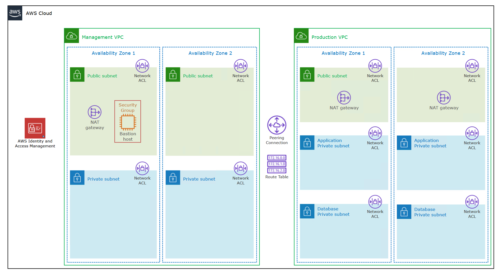
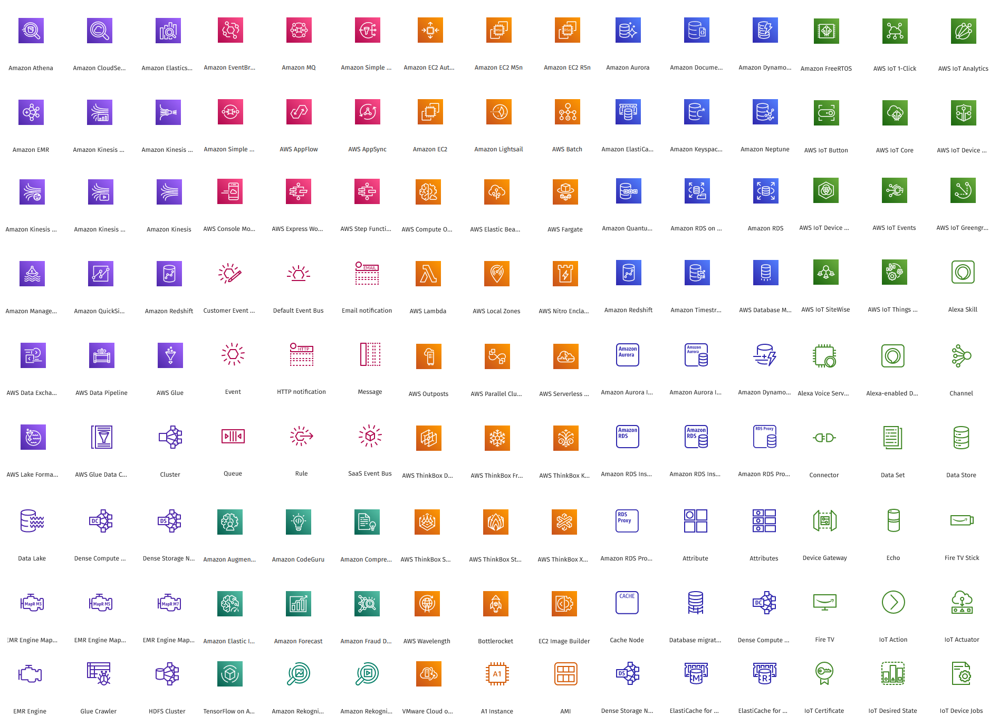
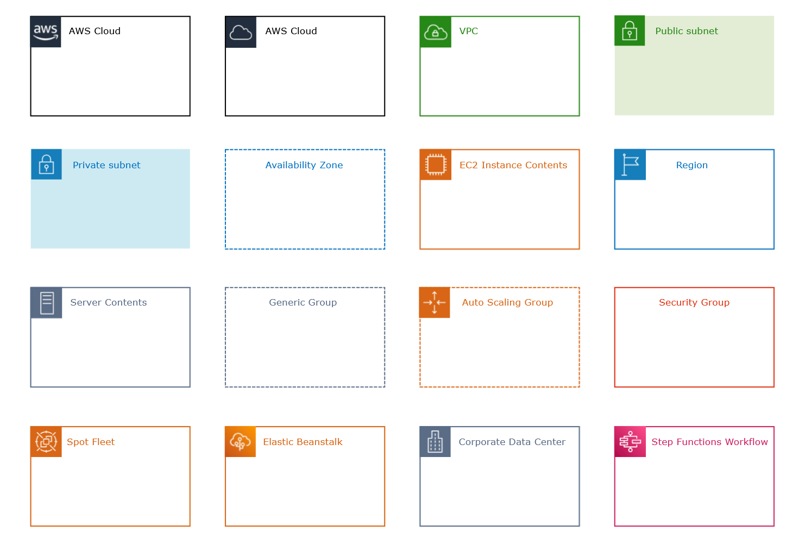

# Cloud & AWS

### Types of cloud providers
* Private:
	* Rackspace
* Public:
	* AWS
	* Google Cloud
	* Azure
* Hybrid:
	* No specific provider, but rather, off-loading some services/features from your own private server onto a public cloud provider. E.g. Storing patient medical records on your own servers and hosting your application on a cloud provider.

### Types of cloud computing
In descending order of degree of flexibility and involvment w/ the CP.
* Infrastructure as a Service (IaaS)
* Platform as a Service (PaaS)
* Software as a Service (SaaS)

### Server management
* On-premises (i.e. managed by you or your company)
	* Applications
	* Data
	* Runtime
	* Middleware
	* OS
	* Virtualization
	* Servers
	* Storage
	* Networking
* IaaS
	* Applications
	* Data
	* Runtime
	* Middleware
	* OS
* PaaS
	* Application
	* Data
* Saas
	* _All attributes are handled by the Cloud Provider_

### AWS Support Plans
* [More info can be found here](https://aws.amazon.com/premiumsupport/plans/).
* Basic support includes the following: (which also applies to all of the other plans too)
	* 24x7 access to customer service, docs, white papers, and AWS re:Post (i.e. AWS stack overflow).
	* AWS Trusted Advisor.
	* AWS Personal Health Dashboard.
	* One-on-one responses to account and billing questions.
	* Service health checks.

<table>
	<tr style="text-align: left">
		<th></th>
		<th>Developer</th>
		<th>Business</th>
		<th>Enterprise On-ramp</th>
		<th>Enterprise</th>
	</tr>
	<tr>
		<td>AWS Trusted Advisor best practices checks</td>
		<td>Service quota + basic security checks</td>
		<td>Full set of checks</td>
		<td>Full set of checks</td>
		<td>Full set of checks</td>
	</tr>
	<tr>
		<td>AWS Trusted Advisor Priority</td>
		<td>-</td>
		<td>-</td>
		<td>-</td>
		<td>Recommendations from AWS account team</td>
	</tr>
	<tr>
		<td>Technical support</td>
		<td>
			<ul>
				<li>Unlimited cases w/ 1 primary contact</li>
				<li>Business hours web access to Cloud Support Associates</li>
				<li>Prioritized responses to AWS re:Post</li>
				<li>General architectural guidance on how services can be used for various use-cases, workloads, or apps</li>
			</ul>
		</td>
		<td>
			<ul>
				<li>24/7 phone, web, chat access to Cloud Support engineers</li>
				<li>Unlimited cases and unlimited contacts (IAM supported)</li>
				<li>Prioritized responses to AWS re:Post</li>
				<li>Access to AWS Support App in Slack</li>
			</ul>
		</td>
		<td>
			<ul>
				<li>24/7 phone, web, chat access to Cloud Support engineers</li>
				<li>Unlimited cases and unlimited contacts (IAM supported)</li>
				<li>Prioritized responses to AWS re:Post</li>
				<li>Access to AWS Support App in Slack</li>
			</ul>
		</td>
		<td>
			<ul>
				<li>24/7 phone, web, chat access to Cloud Support engineers</li>
				<li>Unlimited cases and unlimited contacts (IAM supported)</li>
				<li>Prioritized responses to AWS re:Post</li>
				<li>Access to AWS Support App in Slack</li>
			</ul>
		</td>
	</tr>
	<tr>
		<td>Case severity / Response times</td>
		<td>
			<ul>
				<li>General guidance: < 24 hrs</li>
				<li>System impaired: < 12 hrs</li>
			</ul>
		</td>
		<td>
			<ul>
				<li>General guidance: < 24 hrs</li>
				<li>System impaired: < 12 hrs</li>
				<li>Production system impaired: < 4 hrs</li>
				<li>Production system down: < 1 hr</li>
			</ul>
		</td>
		<td>
			<ul>
				<li>General guidance: < 24 hrs</li>
				<li>System impaired: < 12 hrs</li>
				<li>Production system impaired: < 4 hrs</li>
				<li>Production system down: < 1 hr</li>
				<li>Business-critical system down: < 30 min</li>
			</ul>
		</td>
		<td>
			<ul>
				<li>General guidance: < 24 hrs</li>
				<li>System impaired: < 12 hrs</li>
				<li>Production system impaired: < 4 hrs</li>
				<li>Production system down: < 1 hr</li>
				<li>Business-critical system down: < 15 min</li>
			</ul>
		</td>
	</tr>
	<tr>
		<td>Architectural guidance</td>
		<td>General</td>
		<td>Contextual to your use-case</td>
		<td>Consultative review and guidance based on your applications</td>
		<td>Consultative review and guidance based on your applications</td>
	</tr>
	<tr>
		<td>Programmatic case mgmt</td>
		<td>-</td>
		<td>AWS Support API</td>
		<td>AWS Support API</td>
		<td>AWS Support API</td>
	</tr>
	<tr>
		<td>3rd-party software support</td>
		<td>None</td>
		<td>Provided</td>
		<td>Provided</td>
		<td>Provided</td>
	</tr>
	<tr>
		<td>Proactive programs & self-service</td>
		<td>Support Automation Workflows</td>
		<td>
			<ul>
				<li>Support Automation Workflows</li>
				<li>Infrastructure Event mgmt (for additional fee)</li>
			</ul>
		</td>
		<td>
			<ul>
				<li>Support Automation Workflows</li>
				<li>Infrastructure Event mgmt (one-per-year)</li>
			</ul>
		</td>
		<td>
			<ul>
				<li>Support Automation Workflows</li>
				<li>Infrastructure Event mgmt</li>
				<li>Proactive reviews, workshops + deep dives</li>
			</ul>
		</td>
	</tr>
	<tr>
		<td>AWS Incident Detection and Response</td>
		<td>-</td>
		<td>-</td>
		<td>-</td>
		<td>Provided for an additional fee</td>
	</tr>
	<tr>
		<td>AWS Shield Advanced</td>
		<td>Provided for an additional fee</td>
		<td>Provided for an additional fee</td>
		<td>Provided for an additional fee</td>
		<td>Provided for an additional fee</td>
	</tr>
	<tr>
		<td>AWS Managed Services (AMS)</td>
		<td>-</td>
		<td>Provided for an additional fee</td>
		<td>Provided for an additional fee</td>
		<td>Provided for an additional fee</td>
	</tr>
	<tr>
		<td>Technical Account Manager</td>
		<td>-</td>
		<td>-</td>
		<td>Can choose from a pool of TAMs</td>
		<td>Designated a TAM</td>
	</tr>
	<tr>
		<td>Training</td>
		<td>-</td>
		<td>-</td>
		<td>-</td>
		<td>Online, self-paced labs</td>
	</tr>
	<tr>
		<td>Account assistance</td>
		<td>-</td>
		<td>-</td>
		<td>Concierge Support Team</td>
		<td>Concierge Support Team</td>
	</tr>
	<tr>
		<td>Pricing</td>
		<td><a href="https://aws.amazon.com/premiumsupport/pricing/" target="_blank">Check here</a></td>
		<td><a href="https://aws.amazon.com/premiumsupport/pricing/" target="_blank">Check here</a></td>
		<td><a href="https://aws.amazon.com/premiumsupport/pricing/" target="_blank">Check here</a></td>
		<td><a href="https://aws.amazon.com/premiumsupport/pricing/" target="_blank">Check here</a></td>
	</tr>
</table>

### 5 characteristics of cloud computing
* On-demand self service
	* Users can provision resources and use them w/o human interaction.
* Broad network access
	* Can be accessed over many client platforms.
* Multi-tenancy and resource pooling
	* Multiple customers share the same physical resources. 
	* Security and privacy are taken care of by the provider, but for highly sensitive data, it may be best to use a private server.
* Rapid elasticity and scalability
	* Automatically acquire and dispose of resources as needed.
* Measured service
	* Usage is measured and users pay only exactly for what they use.

### Advantages of cloud computing
* Trade CAPEX for OPEX:
	* No hardware ownership. Reduced Total Cose of Ownership (TCO) and OPEX.
* Benefit from economies of scale:
	* Prices are reduced from cloud providers since they are more efficient due to their large scale.
* No need to guess capacity:
	* This problem is off-loaded to the cloud provider (CP).
* Increased speed and agility.
	* Easy to deploy changes.
	* Can go global in minutes.
* No need to manage private servers since all the maintenance, monitoring, and hardware are handled by the CP.

### AWS has 3 pricing fundamental cost-drivers
* Compute - pay for compute time
* Storage - pay for data stored in the cloud
* Data transfer - pay ONLY for data that leaves the cloud. Data going in is for free.

### AWS infrastructure identities
Hierarchically...
* __Regions__ - physical location on planet.
	* __Availability Zones__ - Consist of 1 or more discrete data centers. Usually 3 AZs exist in a region; 6 max, 3 min. Isolated from disaster. All traffic between AZs is encrypted.
		* __Points of Presence__ (i.e. Edge locations). Only for CloudFront which is a CDN.

### Well-Architected Framework, AWS
* [Labs can be found here](https://www.wellarchitectedlabs.com/?ref=wellarchitected-wp)
* 6 pillars:
	* Operational excellence
	* Security
	* Reliability
	* Performance efficiency
	* Cost optimization
	* Sustainability

# Access/Account/Identity Management in AWS

### Identity and Access Management (IAM)
* Global service
* For managing users within your company that you trust and that need access to various AWSs.
* Root account should only be used to create other accounts.
* Groups cannot contain other groups, only users. 
	* 1 user can belong to a single or many groups.
* For all users, apply the least-privilege-possible policy. That is, only provide access for what the user needs.
	* If the user hasn't accessed a service in a while, consider removing that access.
* __Root user exclusive actions__:
	* Change account settings.
	* View certain tax invoices.
	* Close AWS account.
	* Restore IAM user permissions.
	* Change or cancel your AWS Support plan.
	* Register as a seller in the Reserved Instance Marketplace.
	* Configure an S3 bucket to enable MFA.
	* Edit or delete an S3 bucket policy that includes an invalid VPC ID or VPC endpoint ID.
	* Sign-up for GovCloud.
* An in-line policy is an ad-hoc policy applied to a single user that is not in a group.
* Every IAM JSON policy requires an _Action_ and _Effect_. Every other property is optional or contextually required (e.g. principal).
* Q) Roles vs. groups?
	* _Group_ is a bunch of users with the same policies.
	* _Role_ is a preset policy for service(s).
	* You cannot assign a role to a user. These are exclusively for AWS resources.

### IAM Identity Center
* One login (single sign-on) point for all the following accounts:
	* AWS accounts in AWS Organizations.
	* Business cloud applications (e.g. SalesForce, Box, Microsoft 365).
	* SAML2.0-enabled applications.
	* EC2 Windows Instances.
* Identity providers
	* Built-in identity store in IAM Identity Center.
	* 3rd party --> e.g. Active Directory (MS AD), OneLogin, Okta, etc...
* Formerly called _AWS Single Sign-On_.

### IAM Credentials Report
* A report that lists all the customer's users and the status of thier various credentials.
* Works at an account-level.

### IAM Access Advisor
* Shows service permissions granted to a user and when those services were last accessed.
* Can be used to revise IAM policies.
* Works at a user-level.

### Multi-factor Authentication (MFA)
* 4 types:
	* Virtual MFA device
		* e.g. Google authenticator, Authy
	* Universal 2nd factor (U2F) security key
		* YubiKey
	* Hardware key Fob MFA device
		* Gemalto
	* Hardware key Fob MFA device for AWS GovCloud (US)
		* SurePassID

### Organizations, AWS
* Allows you to managed multiple AWS accounts.
* Global service.
* The main account is the _master account_ and all other accounts are _child accounts_.
* Benefits:
	* Consolidated billing across all accounts.
	* Pricing benefits from aggregated usage (volume discount for EC2, S3, ...).
	* Pooling of Reserved EC2 instances for optimal savings.
* API is available to automate AWS account creation.
* Can restrict account privileges using __Service Control Policy (SCP)__.
* Using a multi-account strategy you can separate accounts by:
	* department / organization unit
	* function
	* cost center
	* dev / test / prod environments
* You can use tagging standards for billing purposes across all accounts.
* You should enable CloudTrail on all accounts and have those logs saved in a central S3 account.
	* And therefore send CloudWatch logs to a central logging account.

### Service Control Policy (SCP)
* SCPs are a type of organization policy that you can use to manage permissions in your organization.
* Allows you to whitelist or blacklist IAM actions.
* Applied at the _Organizational Unit_ or _Account_ level.
* This is applied hierarchically and denies will always override allows.
* SCP rules __never__ apply to the master account, even if explicitly defined.
* Root in any child account is subject to SCP rules.
* Note that SCP rules do __not__ apply to service-linked roles.
	* i.e. roles that enable other AWSs to integrate with AWS Organizations cannot be restricted.
* SCP does not allow anything by default; you must explicitly allow services.
* Use cases:
	* Restrict access to certain services (e.g. HR department cannot use EC2)
	* Enforce PCI (payment card industry) compliance by explicitly disabling services.

### Control Tower, AWS
* Control Tower is an AWS native service providing a pre-defined set of blueprints and guardrails to help customers implement a landing zone for new AWS accounts.
* Easy way to setup and govern a secure, compliant multi-account AWS environment based on best practices.
* Benefits:
	* Automate the set up of your environment in a few clicks.
	* Automate ongoing policy management using guardrails.
	* Detect policy violations and remediate them.
	* Monitor compliance through an interactive dashboard.
* Control Tower runs on top of AWS Organizations.
	* It automatically sets up AWS Organizations to organize accounts and implement SCPs.
* Very comprehensive tool.

### Security Token Service (STS), AWS
* Enables you to create temporary, limited-privileges credentials to access your AWS resources.
	* Short-term credentials --> you configure the expiration period.
* Use cases:
	* _Identity Federation_: manage user identities in external systems and provide them w/ STS tokens to access AWS resources.
	* IAM Roles for cross/same account access.
	* IAM Roles for EC2: provide temporary credentials for EC2 instances to access AWS resources.
* Workflow:

	
	
<i>Credit: Stéphane Maarek</i>

### Cognito, AWS
* Simple, secure sign-up and sign-in for web/mobile users.
* Works for millions of users (how scalable is this???)
* Workflow:

	
	
<i>Credit: Stéphane Maarek</i>

### Directory Services, AWS
* An AWS that allows you to extend Microsoft Active Directory.
* There are 3 ways to utilize AWS Directory Services
	1. __AWS Managed Microsoft AD__
		* Create your own AD in AWS and manage users in AWS.
		* Supports MFA.
		* Establishes "trust" connection w/ your on-premises AD.
	2. __AD Connector__
		* Directory Gateway (proxy) to redirect on-premises AD 
		* Supports MFA.
		* Users are managed on the on-premises data center.
	3. __Simple Active Directory__
		* A standalone, AD-compatible managed directory service on AWS.
			* N.B. this is NOT Microsoft AD; it's an AWS AD-compatible version.
		* Cannot be joined w/ on-premises AD.

# Elastic Compute Cloud (EC2)

### EC2 summary:
* An EC2 instance = AMI (OS) + instance size (CPU + RAM) + storage + security groups + EC2 User Data.
* Security group = firewall attached to an EC2 instance.
* EC2 User Data = script run at the first start of the instance.
* EC2 instance role = link to an IAM role.

### EC2 Instance Types
* General Purpose
	* Balanced. Used for diverse workloads. Good for regular web-apps and code repos.
* Compute Optimized
	* Focus on CPU-intensive tasks. Good for batch processing workloads, media transcoding, machine learning, dedicated game servers.
* Memory Optimized
	* Focus on having large amounts of main memory available. Useful for...
		* High performance relational/non-relational databases, 
		* Distributed web scale cache stores,
		* In-memory databases for optimized business intelligence, 
		* Apps performing real-time processing of big unstructured data.
* Storage Optimized
	* For storage-intensive tasks that require high, sequential read/write access to large data sets in local storage. Useful for...
		* High frequency online transaction processing (OLTP) systems.
		* Relational/NoSQL databases.
		* Cache for in-memory database (e.g. Redis).
		* Data warehousing apps.
		* Distributed file systems.

### Security Groups
* Essentially are firewalls for AWS services.
* They are local to a region. If you make one in one region, you have to make it again in another.
* SCs live outside of the AWS service. So if the SC blocks a connection, the AWS service never even sees it in the first place.
* AWS services and SCs have a many-to-many relationship.
* N.B. If you connect and you get a timeout error, likely an SC issue. If you get any other type of error, likely an application error.
* Be default, all inbound traffic is blocked and all outbound traffic is authorized.
* Security groups act as a firewall at the instance level whereas Network Access Control List (ACL) acts as a firewall at the subnet level.

### EC2 instance purchasing options:
* On-demand
	* For short, light, uninterrupted workloads. 
	* Predictable pricing, pay by the second.
		* No upfront cost, but has the highest rates.
	* No commitments.
* Reserved - (1 or 3 years)
	* Standard reserved Instances - for long or steady-state workloads. e.g. Databases.
		* Upfront cost are optional and the more paid early, the bigger the discount.
		* Reserve a specific instance attribute (instance type, region/zonal, tenancy, OS).
		* You can buy and sell in the Reserved Instance Marketplace.
		* Can save up to 72% compared to on-demand.
	* Convertible reserved instances - long workloads w/ flexible instances.
		* Lower discount compared to Reserved Instances.
		* Allows to change the EC2 instance type, instance family, OS, scope, and tenancy.
		* Can save up to 66% compared to on-demand.
* Savings Plans - (1 or 3 years)
	* More modern approach.
	* Commitment to an amount of usage, not an instance type. Gives a lot of flexibility in terms of instances that can be used.
	* Can save up to 72% compared to on-demand.
	* Any usage that exceeds the savings plan will be billed at the On-demand price.
	* Locked to a specific instance family & AWS region.
	* Flexible across:
		* Instance size (m5.xlarge, m5.2xlarge).
		* OS.
		* Tenancy (host, dedicated, default).
* Spot Instances
	* For short, light, and likely __interruptable__ workloads.
	* Very cheap. Sometimes up to 90% discount compared to On-demand. The most cost-efficient choice.
	* Less reliable since you can lose instances.
		* This happens when your max price is less than the current spot price.
	* Useful for workloads that are resilient to failure. e.g...
		* Batch jobs, data analysis, image processing, any distributed work, or workloads w/ flexible start/end times.
	* NOT suitable for critical jobs or database.
* Dedicated Hosts - book an entire physical server dedicated only to you.
	* Allows you to address compliance requirements and use your existing server-bound software license (per-socket, per-core, etc...).
	* Purchase options: 
		* On-demands - pay per second for active Dedicated Host
		* Reserved - 1 or 3 years (either no upfront, partial upfront, all upfront).
	* The most expensive option.
* Dedicated Instances - no other customer will share your hardware.
	* May share hardware w/ other instances in the same account.
	* No control over instance placement 
* Capacity Reservation - reserve capacity in a specific AZ (availability zone) for any duration.
	* Reserve On-demand instances.
	* You will always have access to EC2 capacity when you need it.
	* No time commitment, no billing discounts.
	* You're charged at On-demand rate whether or not you are running instances.
	* Suitable for short-term, uninterrupted workloads that need to be in a specific AZ.

### Amazon Machine Image (AMI)
* Ready-to-use EC2 instances with our own customizations.
* Can be created manually or throught he EC2 Image Builder pipeline.
* AMIs are bound by region and must be copied over to any other region if needed.

### EC2 Image Builder
* Pipeline, scheduled process for making our own custom AMI w/ test cases and updates.
* Free service, however the EC2 instances that get spun up may incur costs. 

# Storage Systems

## AWS Storage Cloud Native Options
* AWS stores files in its network in its own special way; proprietary.
* 3 types:
	* Block - EBS, EC2 instance store
	* File - EFS
	* Object - S3, S3 glacier
* You need to use either an AWS directly or programmatically through the AWS Storage Gateway.

## Elastic Block Store (EBS)

### EBS summary
* i.e. "network USB stick"
* Block-level storage
* An EBS volume is a network drive you can attach to an instance while they run.
* Allows persistency of data, even after termination.
* They can only be mounted to one instance at a time (at the Certified Cloud Practitioner (CCP) level).
	* Note that an EC2 instance can still have multiple, distinct EBS volumes.
* They are bound to a specific AZ.
* Must provision capacity (GiBs) and speed (IOPS) in advance.
* EBS snapshots are stored incrementally; only billed for the changed blocks stored.

## Instance Store

### Instance Store summary
* Physical hard-drive attached to the server where your EC2 instance lives.
* Block-level storage
* Beats EBS volumes w.r.t to speed/performance.
* Ephemeral. If the EC2 instance terminates, this data is lost.
* If EC2 instance fails, risk of data loss.
	* You must backup and replicate data.
* Use cases: buffer, caching, temporary content.

## Elastic File System (EFS)

### EFS summary
* A managed network file system (NFS).
* File-level storage
* Can be mounted to 100s of EC2s.
* Only works on Linux EC2.
* Available in multiple AZs, Regions, and VPCs.
* Via either AWS Direct Connect or an AWS VPN, on-premises data centers can access the VPC where the EFS instance lives.
* Highly-available, scalable, expensive.
	* Pay per use
	* No capacity planning
	* Roughly 3x more expensive than gp2 EBS volume

### EFS Infrequent Access (EFS-IA)
* A subset of EFS that is cost-optimized.
* This storage class is used for files that are not accessed daily.
* Up to 92% lower cost compared to EFS standard.
* Based on your Lifecycle Policy, EFS will automatically move your files to EFS-IA based on the last time they were accessed.

## Amazon FSx

### FSx summary
* These are 3rd-party high-perf file systems on AWS.
* Fully managed service.
* There are several, but the 2 major ones are:
	* FSx for Lustre
	* FSx for Windows File Server

### FSx for Windows File Server
* Fully managed, highly reliable, and scalable Windows native shared file system.
* Built on Windows File Server.
* Meant for Windows instances. Supports... 
	* SMB protocol
	* Windows NTFS
	* Active Directory

### FSx for Lustre
* Linux + Cluster = Lustre
* For fully managed, scalable file storage, High-Performance Computing (HPC).
* Scales up to 100s GB/s, 10^6+ IOPS, and sub-millisecond latencies.
* This technically stores your data in an S3 bucket.
* Use cases:
	* Machine learning
	* Analytics
	* Video processing
	* Financial modeling

## Simple Storage Service (S3), AWS

### S3 summary
* Advertized as "infinitely scaling".
* Object-level storage.
* Many websites use Amazon S3 as a backbone.
* Many AWS services use Amazon S3 in some capacity. e.g. FSx for Lustre stores data in S3.
* Fun fact: Nasdaq stores the last 7 years of data on S3 Glacier.
* In S3 --> files = objects, directories = buckets.
* Use cases:
	* Backup + storage
	* Disaster recovery
	* Archiving
	* Hybrid cloud storage
	* Application hosting (media, website, etc...)
	* Data lakes + big data analytics
	* Software delivery
	* Hosting static websites

### S3 Buckets
* Must have a globally unique name (across all regions and all accounts).
* Are defined at a regional level.
* Looks like a global service, but buckets are created by region.
* Versioning is enabled at a bucket-level.
* Naming convention:
	* No uppercase, no underscore
	* 3-63 chars
	* Not an IP
	* Must NOT be prefixed w/: xn--
	* Must NOT be suffixed w/: -s3alias

### S3 Objects
* Objects have a key.
	* This key is the FULL path to the object in S3 (NOT the URI).
* Object values are the content of the body
* Max object size = 5TB.
* If you're uploading a file beyond 5GB, must use "multi-part upload."
* Contain metadata + tags.
* Contains version ID if versioning was enabled.

### S3 Security config
* User-based:
	* IAM policies
* Resource-based:
	* Bucket Policies - bucket wide rules from the S3 console. Allows cross-account access.
	* Object Access Control List (ACL) - finer grained. Can be disabled.
	* Bucket Access Control List (ACL) - far less common. Can be disabled.
* Note that an IAM principal can access an S3 object if:
	 * They have EITHER an IAM permission allowing access or if the resource-based policy allows it.
	 * AND there's no explicit deny.
* S3 bucket policies are JSON based. They look similar to IAM policies.

### S3 Replication
* There are two types:
	* Cross-Region Replication (CRR)
	* Same-Region Replication (SRR)
* Requires versioning in both buckets.
* Buckets can be in different AWS accounts.
* Copying is async.
* Must give proper IAM permissions to S3 bukects for Read/Write.
* Use cases:
	* CRR --> compliance, lower latency, replicate to another account.
	* SRR --> log aggregation, live replication between prod and dev environments.

### S3 Storage Classes
* Classes:
	* __S3 Standard - General Purpose__
		* 99.999% availability. i.e. 53 min of downtime per year.
		* Used for frequently accessed data.
			* No data retrieval charges.
		* Low latency, high throughput.
		* Can sustain 2 concurrent facility failures.
		* Use cases: big data, game apps, content distribution.
	* __S3 Standard-Infrequent Access (IA)__
		* 99.9% availability.
		* Lower cost than S3 Standard, but there is a cost on retrieval.
		* Use cases: disaster recovery, backups.
	* __S3 One Zone-Infrequent Access__
		* In a single AZ; data lost when AZ destroyed.
		* 99.5% availability.
		* Use case: secondary backups or data you can recreate.
	* __S3 Glacier Instant Retrieval__
		* Pricing: storage + object retrieval cost.
		* Millisecond retrieval, great for data accessed once a quarter.
		* Minimum storage duration of 90 days.
		* Automatically encrypted.
	* __S3 Glacier Flexible Retrieval__
		* Pricing: storage + object retrieval cost.
		* Fetch tiers: expedited (1 to 5 min), standard (3 to 5 hours), bulk (5 to 12 hours, but free).
		* Minimum storage duration of 90 days.
		* Automatically encrypted.
	* __S3 Glacier Deep Archive__
		* Very low cost.
		* Pricing: storage + object retrieval cost.
		* For long-term storage or archiving.
		* Fetch tiers: standard (12 hours), bulk (2 days).
		* Minimum storage duration of 180 days.
		* Automatically encrypted.
	* __S3 Intelligent Tiering__
		* Small monthly monitoring and auto-tiering fee.
		* Moves objects automatically between Access Tiers based on usage.
		* There are no retrieval charges in S3 Inteligent-Tiering.
		* Tiers:
			* Frequent Access tier: default tier
			* Infrequent Access tier: objects not accessed for 30 days.
			* Archive Instant Access tier: objects not accessed for 90 days.
			* Archive Access tier: (optional) configurable from 90 to 700+ days.
			* Deep Archive Access tier: (optional) configurable from 180 days to 700+ days.  
* All of these storage classes have high durability (99.99999999999%). Yes, that's 11 9's.
* These can be moved manually or via S3 Lifecycle config rules.

# Databases

## Amazon Relational Database (RDS)

### RDS overview
* All databases in AWS are managed. No need to directly handle security updates and backing up manually.
* These are all SQL based.
* Can be scaled vertically or horizontally.
* Cannot SSH into database instances.
* All storage for RDS is done w/ Elastic Block Storage (EBS) volumes.
* The supported databases are:
	* Postgres
	* MySQL
	* MariaDB
	* Oracle
	* SQL Server
	* Aurora (AWS proprietary DB)

### Aurora, AWS
* Proprietary software from Amazon.
* Optimized for the AWS cloud and is therefore much faster and efficient than other engines.
* It costs more to use; approx. 20% more.
* Storage grows automatically by increments of 10 GB all the way to 64 TB.
* Aurora comes in two flavors: PostgreSQL and MySQL.

### RDS deployment
* Read replicas
* Multi-AZ
* Multi-region

### ElastiCache, AWS
* Used to get managed Redis or Memcached data.
* These are all in-memory and therefore very fast for reads.
* Since this is managed by AWS, all infrastructure work + maintanence is done by AWS.

## Amazon NoSQL databases

### DynamoDB, AWS
* Flagship product from Amazon in the DB realm.
* Key/Value database.
	* Composed of a primary key and attributes
		* Primary key --> partition key + sort key (optional)
		* Attributes --> Any columns you want for the data
	* Schema is defined per item; NOT table-wise.
* Fully managed, highly available w/ replication across 3 AZs.
* Supports reservations for cost optimization. i.e. reserved capacity.
* Scales to massive workloads, distributed "serverless" database.
	* No need to provide provisions or specs upon creation.
* Single-digit, millisecond latency. Very fast compared to other AWSs.
* Auto-scales. Low cost.
* Table classes:
	* Standard
	* Infrequent Access (IA)

### DynamoDB Accelerator (DAX)
* Exactly as DynamoDB, but in-memory. i.e. cached.
* 10x performance improvement over regular DynamoDB.
* Do NOT use ElastiCache for in-memory DynamoDB. DAX performs far better.

### DynamoDB Global Tables
* Makes a DynamoDB table accessible in multiple regions w/ low latency.
* The data gets replicated to other regions. Active-Active replication.
	* Note that read/writes can be done on any region
	* Question: How does this data get propogated to other regions? Eventual consistency?

### DocumentDB, AWS
* Similar to Aurora, but built on top of MongoDB, therefore this is a document-based NoSQL database.
* Similar deployment concepts as Aurora.
* Fully managed w/ replication across 3 AZs.
* Grows in same increments as Aurora.
* Automatically scales to workloads w/ millions of requests per second.

### When to use Native MongoDB vs. DocumentDB vs. DynamoDB
* Native MongoDB provides the most flexibility
	* Harder to setup.
	* Suitable for flexible, broadt document storage types.
* DynamoDB has the least amount of flexibility
	* Easiest to setup.
	* Suitable for transactional-based document storage.
* DocumentDB is somewhere in between
	* Should only be used for apps with high workloads.
	* Smallest size is 2 CPU, 16GB RAM.
	* Suitable for when your MongoDB project has gotten to big to handle and you need your DB to be more managed by AWS, but at an increased cost.

## Other database services

### Redshift, AWS
* Used for __Online analytical processing (OLAP)__.
* Based on PostgreSQL, but not for OLTP.
* Loads data once every hour.
* 10x perf over other data warehouses. Scales in PBs.
* Columnar storage of data (not row-based).
* Massively Parallel Query Execution (MPP).
* Pay as you go model based on provisioned instances.
* BI tools such as AWS Quicksight and Tableua integrate with it.

### Elastic MapReduce (EMR), Amazon
* Helps w/ creating Hadoop clusters (big data) to analyze and process vast amount of data.
* Clusers can be made with 100s of EC2 instances.
* EMR takes care of all of the provisioning and config.
* Auto-scaling and integrated w/ Spot instances.
* Use cases: data processing, ML, web indexing, big data

### Athena, Amazon
* Severless query service to __perform analytics against S3 objects__ in the order of petabytes.
* Supports: CSV, JSON, ORC, Avro, and Parquet.
* SQL-based.
* Pricing is 5 USD per TB of data scanned. 
	* Pricing can be reduced via compression or using columnar data
* Use cases: BI, analytics, VPC flow logs, reporting, ELB logs, CloudTrails, etc...

### QuickSight
* Serverless ML-powered BI service to create interactive dashboards.
* Automatically scales.
* Embeddable.
* Use cases: 
	* BI
	* Reporting
	* Ad-hoc analysis
* Integrated w/ many AWSs.

### Neptune, Amazon
* Fully managed __graph database__.
* Highly available across 3 AZs w/ up to 15 read replicas.
* Can store up to billions of relations and query the graph w/ millisecond latency.
* Use cases: social networks, knowledge graphs, fraud detection, recommendation engines, applications w/ high-connected data sets.

### Quantum Ledger Database (QLDB), Amazon
* Fully managed, serverless, highly available.
* Replication across 3 AZs.
* Can be used to review history of all the changes made to your application data over time.
* Immutable system. Can enable cryptographic signing for additional proof of integrity.
* 2-3x better perf than common ledger blockchain frameworks.
* Use cases: recording immutable financial transactions (i.e. a ledger).

### Managed Blockchain, Amazon
* Very similar to Amazon QLDB, however, this is decentralized a la blockchain.
* Compared to Amazon QLDB, there is no central authority holding the blockchain.
* Compatible w/ _Hyperledger Fabric_ and _Ethereum_.

### Glue, AWS
* Fully managed. Serverless.
* __Extract, transform, and load (ETL) tool__.
* __Glue Data Catalog__ is a central repository for structural + operational metadata for data assets stored in Glue.
* Use cases: data preparation for analytics, especially across multiple, different sources.

### Database Migration Service (DMS)
* Performs database migrations that are quick, secure, resilient, and self-healing.
* The source DB remains available during migration; no need to take it offline during the process.
* Must be run on an EC2 instance.
* Supports:
	* Homogeneous migrations: e.g. Oracle to Oracle
	* Heterogeneous migrations: e.g. SQL Server to Aurora

# Edge Computing

## AWS Snow Family

### Snow Family summary
* High-secure, portable devices.
* Used to collect and process data the the edge.
* Used to migrate data into and out of AWS.
* Must be requested and will be shipped by Amazon.
* These devices are borrowed. Can be held for up to 1 or 3 years at discounted pricings.
* __AWS OpsHub__ is the GUI to access/manage these snow family devices.
* These are all physical data transport solutions.
	* Anytime it is not feasible to send such large quantities of data over the network, use the snow family.
* 3 types (from smallest to biggest):
	* Snowcone
	* Snowball Edge
	* Snowmobile

### DataSync, AWS
* Secure, online data transfer service that simplifies, automates, and accelerates copying terabytes of data to and from AWS storage services.
* Replication tasks can be scheduled hourly, daily, weekly, etc...
* All replication tasks are __incremental__ after the first full load.
* Can copy data between:
	* network file systems (NFS)
	* server message block (SMB)
	* self-managed object storage
	* AWS Snowcone
	* S3
	* elastic file system (EFS)
	* Amazon FSx for Windows File Server

### Snowcone
* Very small, only 2.1 kg.
* Rugged and can withstand harsh environments.
* Specs:
	* 8 TB of usable storage
	* 2 CPU 
	* 4 GB memory
	* Powered by USB-C or battery
* Can be used for either edge computing or edge storage.
* Comes pre-installed w/ DataSync agent.
	* Can migrate up to 24 TB of data online.
* Use case:
	* When you have data stores in remote locations and you need to do small transfers often.

### Snowball Edge
* About the size of a briefcase.
* Pay per data transfer job.
* Provides block storage and S3-compatible object storage.
* Supports clusters up to 15 nodes.
* 2 types:
	* Snowball Edge Storage Optimized:
		* 80 TB of HDD
		* 40 vCPU
		* 80 GiB memory
		* Object storage clustering available
	* Snowball Edge Compute Optimized:
		* 42 TB of HDD
		* 52 vCPU
		* 208 GiB memory
		* (Optional) GPU
* Use case:
	* Large data cloud migrations,
	* Disaster recovery,
	* Data center decommission

### Snowmobile
* Literally a truck for sending data.
* Each snowmobile has 100 PB of capacity.
* Purely for data transfer. There is no edge computing than can be done w/ this solution.
* Use case:
	* Anytime you need to transfer for than 10 PB of data.

# Other Compute Services

## Container Services

### Elastic Container Service (ECS)
* Allows Docker containers to run on AWS via EC2 instances.
* EC2 instances must be provisioned and infrastructure must be maintained. Ergo, not serverless.
* AWS will take care of starting/stopping containers.
* Integrated w/ an application load balancer.

### Fargate
* Allows Docker containers to run on AWS.
* Serverless. No need to provision any infrastructure.
	* AWS runs containers for you based on needed CPU & RAM.

### Elastic Container Registry (ECR)
* Private Docker registry on AWS.
* For storing Docker images that can be run by other AWSs.
	* Fargate and ECS use this service to fetch images.

## Function-as-a-Service (FaaS)

### Lambda, AWS
* Serverless, but bound by Region.
* Virtual functions that run on-demand. i.e. _Event-driven_ functions.
* Can setup a trigger to run for some event in S3.
* Scales automatically.
* Max execution time of 15 minutes.
* Much better to use than doing it yourself via EC2 and autos
* Billing is done via: 
	* _(function compute time) * (RAM provisioned)_
	* _Number of times function was invoked_
* Supports some languages, but if you want to unsupported ones, you need to use Docker and implement the lambda runtime API.
* Monitored through AWS CloudWatch.
* Use cases:
	* Create thumbnails for images uploaded into S3.
	* Run a severless cron job.

### API Gateway, Amazon
* Serverless and scalable.
* This works in tandem w/ Lambda.
* Allows Lambda functions to be exposed as HTTP APIs.
	* RESTful
	* WebSockets

### Batch, AWS
* Fully managed.
* Can run at any scale. e.g. running 100,000s of batch jobs.
* N.B. that a "batch job" is a job with a definitive start/end times. Not continuous.
* Runs a set of batch jobs on AWS across managed EC2 instances or Spot instances.
* Batches can be defined via Docker images that run on top of the ECS.
* Use cases: similar to Lambda use cases.

### Step Functions, AWS
* Allows building of visual workflows to orchestrate customer's Lambda functions.
	* Can be integrated w/ EC2, ECS, on-premises servers, API gateway, SQS, etc...
	* Can implement a human approval feature.
* Serverless.
* Use cases:
	* Order fulfillment
	* Data processing
	* Any kind of workflow
* Below is an example of a visual workflow made w/ AWS Step Functions:

	
	
<i>Credit: Stéphane Maarek</i>

## Lightsail, Amazon
* Provides virtual server, storage, databases, and networking.
* This service is designed **for people w/ little cloud experience!**
	* Much simpler than using EC2, RDS, ELB, EBS, etc...
* Can setup notifications and monitoring of your Lightsail resources.
* High availability, but no auto-scaling.
* Limited AWS integration.
* This is generally a poor solution if you already know how to work w/ most AWSs.
* Use cases:
	* Simple web apps.
	* Websites from WordPress, Magento, Plesk, or Joomla.
	* Dev / Test environment.

## Machine Learning

### Rekognition
* For finding objects, people, text, scenes in images and videos using ML.
* Facial analysis and facial search to do verification or people counting.
* Can create a database of "familiar faces."
* Bound by Region.
* Use cases:
	* Labeling
	* Content moderation
	* Text detection
	* Face detection + analysis (e.g. gender, age, emotions)
	* Face search + verification
	* Celebrity recognition
	* Pathing (e.g. sports game analysis)

### Transcribe
* Speech-to-text ML service.
* Utilizes Automatic Speech Recognition (ASR) deep learning process.
* Note, you can configure it to automatically remove an personally identifiable information via redaction.
* Supports multi-lingual audio identification.
* Use cases:
	* Transcribe customer service calls
	* Automate closed captioning/subtitling
	* Generate metadata for media assets

### Polly
* Text-to-speech ML service.

### Translate, AWS
* Natural language translation.
* Allows you to localize (i.e. translate) content for international users.
* Works well w/ large volumes of text.

### Lex & Conntext, Amazon
* Amazon Lex: 
	* Is the same tech used to power Alexa
	* Automatic Speech Recognition
	* Natural Language Understanding to recognize intent of text/calls
	* Helps build chatbots
* Amazon Connect:
	* Can receive calls, create contact workflows
	* Cloud-based virtual contact center
	* Can integrate w/ other CRM (customer relationship sys.) systems or AWS
	* No upfront payments. 80% cheaper than traditional contact center solutions

### Comprehend, Amazon
* For Natural Language Processing (NLP).
* Fully managed. Serverless.
* Uses ML to find insights and relationships in text. e.g...
	* Language of the text
	* Extract key phrases, places, people, events, etc...
	* Understand how positive/negative the text is
	* Analyze text using tokenization and parts of speech
	* Automatically organize a collection of text files by topic
* Use cases:
	* Analyze customer interactions (e.g. email) to find what leads to positive/negative UX.
	* Create and group articles by topic that Comprehend will uncover.

### SageMaker, Amazon
* For devs/data scientist to build ML models. _For the pros._
* Fully managed.
* Typically difficult to do all the processes in one place. Need to provision services. Lots of setup.

### Forecast, Amazon
* For forecasting via ML.
* Fully managed.
* Use cases:
	* Product demand planning
	* Financial planning
	* Resource planning

### Kendra, Amazon
* Document search service via ML.
* Fully managed.
* Extract answers from within a document (text, PDF, HTML, PowerPoint, Word, etc...)
* Kendra builds an index on all of these documents for fast searching.
* Contains natural language search capabilities.
* Can learn incrementally via user interactions + feedback.

### Personalize, Amazon
* ML service for real-time, personalized recommendations.
* Fully managed.
* Same tech used in Amazon.com's recommendation system.
* Implementation takes days rather than months. You don't need to build, train, and deploy ML solutions.
* Use cases:
	* Retail stores
	* Media + entertainment

### Textract, Amazon
* For extracting text, handwriting, or any scannable documents via ML.
	* e.g. scanning a driver's license and extract all of the text fields.
* Use cases:
	* Document scanning service
	* Handwriting extraction
	* Processing hand-written financial invoices, medical records, insurance claims, etc...

# Scaling and Elasticity

### Load Balancers in general
* Spreads load across multiple downstream instances.
* Expose a single point of access (DNS) to your application.
* Seamlessly handle failures of downstream instances.
* Do regular health checks to your instances.
* Provide SSL termination (HTTPS) for your websites.

### Elastic Load Balancer (ELB) summary
* Fully managed by AWS.
* Limited configuration.
* __Allows customer to use EC2 instances across multiple AZs.__
* AWS offers 3 load balancer subsets:
	* Layer 7 - _Application Load Balancer_ (HTTP/HTTPS/gRPC only).
	* Layer 4 - _Network Load Balancer_ (TCP/UDP/TLS over TCP, ultra-high perf).
	* Layer 3 - _Gateway Load Balancer_ (GENEVE protocol on IP packets).
		* This kind is a special case because it is more used for routing traffic through firewalls + intrusion detection.
		* Upon receiving packets, traffic is first routed to 3rd Party Security Virtual Appliances and the to your app (e.g. EC2 instance).
	* Layer 7 & 4 - Classic Load Balancer. (This is getting retired in 2023, don't use this anymore).

### Auto Scaling Groups (ASG) summary
* Scales out (add instances) or in (remove instances) to match load.
* Free service.
* Ensures we have a minimum and maximum number of instances running.
	* Replaces unhealthy/terminated instances.
* Can automatically register instances to the load balancer (ELB).
* Purpose: cost savings. Running at optimal capacity.
* Auto-scaling strategies:
	* Manual Scaling: Basically do-it-yourself approach.
	* Dynamic Scaling: Responding to changing demand.
		* Simple/Step Scaling:
			* e.g. When a CloudWatch alarm is triggered at (CPU > 70% for 10 minutes), then add 2 instances.
			* e.g. When a CloudWatch alarm is triggered at (CPU < 30% for 10 minutes), then remove 1.instance.
		* Target Tracking Scaling:
			* e.g. I want the avg. ASG CPU to stay around 40%.
		* Scheduled Scaling:
			* Anticipate scaling based on known usage patterns.
			* e.g. increase the minimum capacity to 10 units on Fridays at 5PM.
		* Predictive Scaling:
			* Uses machine learning to predict future traffic ahead of time.

### Hybrid Cloud
* Amazon is pushing for a blend between on-premises servers and integration w/ Amazon servers.
* Amazon stores data very differently (proprietary) compared to other file systems. This is where AWS Storage Gateway comes in.
* __AWS Storage Gateway__ bridges the way between on-premises servers and AWS (e.g. S3 or EBS).
	* For all 3 files types (File, Volume, Tape), all transferred data is encrypted via SSL.

# Deployment & Managing Infrastructure

### CloudFormation, AWS
* __Declarative__ tool for starting + configuring many (not all) AWSs at scale.
* Excellent for setup. Can destroy and re-create an infra on the cloud on the fly.
* Declarations that make-up the stack are called CloudFormation Templates.
* Provides a relationship diagram based on markup input.
* Each resource in the stack will be tagged such that you can easily identify the cost of the entire stack.
* "Infrastructure as code"
* Note that you __CANNOT__ use CloudFormation to move data or applications into another region.
	* You can use CloudFormation to setup all the needed resources, but you will need to manually add the data and apps to this new region.

### Cloud Development Kit (CDK), AWS
* An SDK to programmatically write AWS infra code.
	* This code gets "compiled" to CloudFormation JSON/YAML.
* Supports many popular languages like Python, C#, JavaScript, etc...

### Elastic Beanstalk, AWS
* Quick tool for building 3-tier web-apps (Load balancer / App / Database). Developer friendly.
* "Platform-as-a-Service"
* Managed service.
* Still have full control over all configs of AWSs.
* Free service, but you still have to pay for underlying instances.
* Provides health monitoring dashboards. Integrated w/ CloudWatch.
* Technically uses CloudFormation to deploy + configure.
	* Beanstalk is more application-focused while CloudFormation is more infra-focused.
* 3 architectural models:
	* Single instance deployment: good for dev environment
	* Load balancer + Auto scaler group: great for prod/pre-prod web apps.
	* Auto scaler group only: for non-web apps. e.g. workers.
* Health monitoring:
	* Can determine that the environment's Auto Scaling group is available and has a minimum of at least one instance.
	* Publishes metrics to CloudWatch.	

### CodeDeploy
* Hybrid service.
* Serverless.
* For automatic code deployment on EC2 instances or on-premises servers.
* Note that the servers/instances must be preconfigured w/ the CodeDeploy agent.

### CodeCommit
* AWS version control repo made by Amazon.
* Fully managed.
* Serverless.

### CodeBuild
* Builder service for code that is fetched from a repo. e.g. CodeCommit.
	* Can run tests (unit/integration tests?)
* Fully managed.
* Serverless.
* Only pay for build-time.

### CodePipeline
* Orchestration tool for CI/CD.
* Fully managed.
* Serverless.
* Uses CodeDeploy, CodeCommit, CodeBuild, and Elastic Beanstalk (possibly more).
* Compatible w/ 3rd parties.
* Orchestration example: Code --> Build --> Tests --> Provision --> Deploy.
* Uses CloudWatch Events to detect changes in CodeCommit repos used as a source for a pipeline.

### CodeArtifact
* Artifact management system. For storing/retrieving dependencies.
* Works w/ popular package managers like Pip, NuGet, npm, etc...
* Serverless.

### CodeStar
* Unified UI for managing software dev activities.
* Quick way to get started w/ all of the Code-family services.
* Serverless.
* CodeStar + Cloud9 allows you to develop, build, and deploy serverless web apps.

### Cloud9
* In-browser cloud IDE.
* NOT serverless. Requires an EC2 instance w/ Cloud9 installed.
* Allows for code collaboration in real-time.

### Systems Manager (SSM)
* Allows customer to centralize operational data from multiple AWS and automate tasks across customer's AWSs.
	* __Helps w/ managing EC2 and on-premises systems at scale.__
	* Can create logical groups of resources such as applications, different layers of app-stacks, or prod vs. dev environments.
* Comprehensive feature list. Below is a short list of important features:
	* Patching automation for enhanced compliance.
	* Run commands over a __fleet__ of servers.
	* Store parameter configs w/ __SSM Parameter Store__.
	* View API activity, resource config changes, software inventory, patch compliance status, and operational alerts.
	* Data is aggregated and put into visualizations/graphs for insights.
* Hybrid service.
* Works w/ Linux and Windows.
* __SSM Session Manager__ allows us to connect to an EC2 instance or on-premises server w/o SSH or any exposed connection.
	* This is possible via the SSM agent installed on the instance/server and AWS.

### OpsWorks, AWS
* For automatic server configuration or performing repetitive tasks.
* OpsWorks == Managed __Chef__ and __Puppet__.
* Alternative to SSM.
* Hybrid service.
* Can only provision standard AWS resources. e.g. EC2, RDS, etc...

# Leveraging AWS Global Infrastructure

### Route 53
* Highly available, scalable, cloud Domain Name System (DNS).
* Fully managed.
* Global.
* Can perform health checks on customer applications, web servers, or any other resources.
* Can do domain name registration w/ Route 53.
* Routing policies:
	* Simple Routing Policy - Basic. Only policy w/ no health checks.
	* Weighted Routing Policy - Distribute traffic among weighted EC2 instances.
	* Latency Routing Policy - Users redirected based on geographical proximity to an AZ.
	* Failover Routing Policy - If health of primary instance is bad, switches to the failover instance. For distaster recovery. For active-passive config.

### CloudFront
* Content Delivery Network (CDN).
* Integrated w/ AWS Shield.
* Price varies depending on the region.
* Improves the read perf of content via caching at edge locations --> what a CDN basically does.
* CloudFront origin types:
	* S3 bucket
		* __Origin Access Control__ can be used to only allow CloudFront to access these buckets.
		* Can be used as an ingress (i.e. upload files to S3).
	* Any custom origin (HTTP)
		* App load balancer (ALB).
		* EC2 instance.
		* S3 static website.

### S3 Transfer Acceleration
* Tool for quickly uploading/downloading objects between S3 buckets, regionally.
* For optimizing __transfer speed__ of S3 objects.
* Global tool.
* [Speed tester](https://s3-accelerate-speedtest.s3-accelerate.amazonaws.com/en/accelerate-speed-comparsion.html)

### Global Accelerator, AWS
* For improving global application availability and perf via the AWS global (internal) network.
	* Therefore, this operates in layer 4 (TCP and UDP) and is a good for non-HTTP use cases.
* Integrated w/ AWS Shield.
* Can see up to 60% improvment in speed.
* Users will first access the nearest edge location which will then leverage the AWS network and talk to whatever resource it is looking from within.
* 2 Anycast IPs (i.e. shared, static IP address) are created for your app and traffic is sent there via edge locations (i.e. Points of Presence).
* Global Accelerator and CloudFront use the same edge locations.
* [Speed tester](https://speedtest.globalaccelerator.aws/)
* Use cases:
	* For resources that require a static IP address.
	* Anytime you need fast, deterministic regional failover.

### Outposts, AWS
* Literal server racks given to your business by Amazon.
* Outposts offers AWS infrastructure services (not all) on-premises.
* Caveat: you are responsible for the physical security of AWS Outposts since it physically lives in your rack space.
* Software service is fully managed by AWS.
* Eases development in hybrid cloud environments.

### WaveLength, AWS
WaveLength Zones are infrastructure deployments embedded within telecom provider datacenters at the edge of 5G networks.
* For running __ultra-low latency applications through 5G networks.__
* Many AWSs available, e.g. EC2, EBS, VPC, etc...
* No additional charges or service agreements.
* Traffic doesn't leave the Comm. Service Provider (CSP) network.
	* However, you still have a high-bandwidth, secure connection to the parent AWS region.
* Use cases:
	* Smart cities.
	* ML-assisted diagnostics.
	* Connected vehicles.
	* AR/VR, real-time gaming.

### Local Zones, AWS
* Closer to end users to run latency-sensitive applications.
* Extends your VPC to more locations.
* This is more limited since most Local Zones seem to be in few cities and mostly in the US.
* Use cases: ???

### Global Applications Architecture
<table>
	<tr style="text-align: left">
		<th>Single Region, Single-AZ</th>
		<th>Single Region, Multi-AZ</th>
		<th>Multi-Region, Active-Passive</th>
		<th>Multi-Region, Active-Active</th>
	</tr>
	<tr>
		<td>❌ Low availability</td>
		<td>☑️ Good availability</td>
		<td>✔️ Highest availability</td>
		<td>✔️ Highest availability</td>
	</tr>
	<tr>
		<td>❌ Poor global latency</td>
		<td>❌ Poor global latency</td>
		<td>✔️ Great global read latency, ❌ poor global write latency</td>
		<td>✔️ Great global read/write latency</td>
	</tr>
	<tr>
		<td>✔️ Easy setup</td>
		<td>✔️ Slightly easy setup</td>
		<td>❌ Hard setup</td>
		<td>❌ Very difficult setup</td>
	</tr>
</table>

# Cloud Integrations

### Simple Queue Service (SQS)
* Fully managed. Serverless.
* Event-based, queueing service to decouple applications. (e.g. microservices)
* Default message retention = 4 days; 14 days maximum.
* No limit on how many msgs can be in the queue.
* Messages are deleted after they're read by the consumer.
* Horizontal scaling solution.
* Oldest AWS (over 10 years old).

### Simple Notification Service (SNS)
* Fully managed. Serverless.
* Event-based Publisher/Subscriber model (for decoupling applications).
	* Publisher sends a message to a topic (an SNS topic) and any subscribers to that topic will receive that message if they are available.
	* Messages are not saved in the topic; they are sent immediately.
* Up to 12,500,000 subscriptions per topic, 100,000 topics limit.

### Simple Email Service (SES)
* Cloud-based email service provider that can integrate any application for bulk email sending.
* Fully managed. Serverless.

### MQ, Amazon
* Not an ideal solution unless you are migrating your on-premises infra to AWS and you are already using a separate messaging broker service.
	* Any service using MQTT, AMQP, STOMP, OpenWire, or WSS (WebSockets) could be migrated using Amazon MQ.
	* e.g. RabbitMQ or Apache ActiveMQ.
* Note that MQ does not scale nearly as well as SNS/SQS.
* MQ is not serverless, but can run in multi-AZ w/ failover.
* MQ has both queue and topic features.

### Kinesis, Amazon
* For real-time big data streaming.
	* To collect, process, and analyze real-time streaming data at any scale.
* Managed service.
* Sub-services:
	* Kinesis Data Streams: low latency streaming to ingest data at scale from thousands of sources.
	* Kinesis Data Firehose: load streams into AWSs like S3, Redshift, ElasticSearch.
	* Kinesis Data Analytics: perform real-time analytics on streams using SQL.
	* Kinesis Video Streams: monitor real-time video streams for analytics or ML.

# Cloud Monitoring

### CloudWatch, Amazon
* Centralized service for alarms, metrics, and logging across all (many?) AWSs.
* Note that billing metrics/alarms can only be done in us-east-1 (N. Virgina).
* Sub-groups:
	* __Metrics__
		* Provides metrics for every service in AWS. e.g. CPUUtilization, NetworkIn, ...
	* __Alarms__
		* Used to trigger notifications/actions for any metric.
		* e.g. auto scaling, EC2 actions depending on an event, or SNS notifications.
		* These alarms are simple and not as powerful as AWS Budgets.
	* __Logging__
		* Enables real-time monitoring of your logs.
		* Adjustable log retention period.
		* By default, EC2 instance will NOT send data to CloudWatch. You need to create the CloudWatch log agent on the EC2 instance.
		* Can collect logs from: Elastic Beanstalk, ECS, Lambda, CloudTrail, CloudWatch log agent (for EC2), Route53 DNS queries.

### EventBridge, Amazon
* Service that lets you react to events in AWS.
	* Can schedule Cron jobs.
	* Can do an action if some event pattern is satisfied. e.g. someone logs in w/ root --> send out SNS topic.
* Serverless.
* Formerly called "CloudWatch Events".
* Capable of receiving events from AWS partner companies. (e.g. DataDog, Zendesk)
* You can create your own event bus from your apps to send to EventBridge.

### CloudTrail, Amazon
* For __auditing, compliance, and governance__. Powerful tool for investigation across all AWSs.
	* e.g. get history of events or API calls made within your AWS account.
	* e.g. see what commands a user typed in the CLI when he/she was logged in.
* 3 types of events:
	* _Management events_ - (enabled by default)
	* _Data events_ - (disabled by default. Can enable w/ fee.)
	* _CloudTrail Insights events_ - (disabled by default. Can enable w/ fee.)
* Enabled by default for all AWSs.
* Logs can be saved to CloudWatch of S3.
* _Insights_ is an automatic service in CloudTrail for your CloudTrail events. Needs to be enabled first and customer will incur additional fees.
* CloudTrail logs are automatically encrypted.

### X-Ray, AWS
* Used for distributed system debugging.
* Provides visual analysis of your application. Useful for...
	* Prod. debugging. Find errors/exceptions.
	* Understanding dependencies in a microservice architecture.
	* Identifying bottlenecks.
	* See if we are meeting our SLA.
* Trace requests made through your distributed applications.

### CodeGuru, Amazon
* ML-powered service for __automated code reviews__ and __application performance recommendations__.
* Two powerful functionalities
	* CodeGuru Review: automated code reviews for static code analysis
	* CodeGuru Profiler: visibility/recommendations about app performance during runtime.
* Supports only Java and Python, currently.
* Integrated w/ GitHub, Bitbucket, and AWS CodeCommit.
* CodeGuru Profiler adds a small overhead to the application.

### Service Health Dashboard, AWS
* Shows the health of all services in all regions. General.
	* Also shows historical data.
* Has an RSS feed you can subscribe to.
* [You can check here](https://status.aws.amazon.com/)

### Personal Health Dashboard, AWS
* Shows AWS events that impact your infra.
	* Provides alerts and remediation guidance as needed.
* Serverless.

# Cloud Networking, Security, and Compliance

## Virtual Private Cloud (VPC)

### VPC summary
* A private, logically (not physical) isolated network to deploy your resources on the AWS cloud (by Region).
* VPCs are bound by Region.
* Use cases: Anytime you want to isolate/expose services or resources in your private, cloud network. e.g. subnetting.

### VPC Endpoints
* Provides private access (i.e. not over the internet) to AWSs; not necessarily to other VPCs.
* Provides lower latency and better security.
* There are 2 VPC endpoints:
	* __VPC Endpoint Gateway__. Used only for S3 and DynamoDB.
	* __VPC Endpoint Interface__. Used for all other AWSs. Interface endpoints are powered by AWS PrivateLink.
* N.B. Use VPC Peering to connect VPCs together. Use VPC endpoints to connect a VPC to a specific AWS resource, e.g. an EC2 instance. (CHECK)

### VPC Peering
* Connects two VPCs, privately using AWS' network; doesn't go over the internet.
	* Makes connection more secure by virtue of it living soley within AWS.
* Makes them behave as if they were on the same VPC network.
	* IP address ranges cannot have overlap. e.g. no overlapping CIDR blocks.
* Peering connections are __not__ transitive. That means that each VPC needs an explicit connection to one-another.
	* e.g. If A <--> B, and C <--> A, then B <-/-> C unless we explicit setup a VPC peering connection.
* Use this over PrivateLink if you want to connect VPCs that are local to your AWS account or another owned AWS account. (CHECK)

### PrivateLink, AWS (VPC Endpoint Services)
* Most secure and scalable way to expose a service to 1000s of VPCs.
* Does not require VPC peering, internet gateway, NAT, route tables, etc...
* Requires a network load balancer (from the Service VPC) and an Elastic Network Interface (Customer VPC).
* Use this over VPC Peering if you need to privately connect to a 3rd party VPC.

### VPC Flow Logs
* Logs network traffic for...
	* VPC
	* Subnet
	* Elastic Network Interface
* Helps to monitor and troubleshoot connectivity issues. e.g.
	* Subnets to internet
	* Subnets to subnets
	* Internet to subnets
* Also captures network information from AWS managed interfaces too:
	* Elastic Load Balancer
	* ElastiCache
	* RDS
	* Aurora
	* etc...
* Flow Logs can be exported to S3 or CloudWatch logs.

## Other Networking

### Subnets
* Allows you to partition your network inside your VPC.
* This is bound by AZ.
	* Therefore, a VPC lives in a region, and a subnet lives in an AZ. Since each region has a minimum of 3 AZ, by default, you can expect 3 subnets.
* Public subnets are internet accessible, private subnets aren't.
	* To define access between the internet and between subnets, we use __Route Tables__.
	* For public subnets to access the internet, they require an __Internet Gateway (IGW)__. The public subnet needs a route to the IGW and the IGW goes to the internet.
	* For private subnets to access the internet, they require a either a __Network Address Translation (NAT) Gateway__ or __NAT Instance__.
		* NAT Gateways are AWS-managed.
		* NAT Instances are self-managed.
		* In full, a private subnet must have a route to either a NAT (either) that lives in the public subnet and the public subnet needs a route to an IGW.
* N.B. it is recommended to look up graphs for these topologies online since visualizations help a lot and are used a lot in this topic.

### Security Groups
* A firewall that __controls traffic to and from an Elastic Network Interface or an EC2 instance__.
* Can only have ALLOW rules.
* Stateful. Return traffic is automatically allowed, regardless of any rules.
* Rules apply to IP addresses and other security groups.
* The console for this service is exactly the same as the one for EC2.

### Network Access Control List (NACL)
* A firewall that __controls traffic to and from a subnet__.
* Can have ALLOW or DENY rules.
* Stateless. Rules are always evaluated at ingress and egress.
* Rules only apply to IP addresses.

### Site-to-site VPN
* Connects an on-premises VPN to AWS.
	* The on-premises center must use __Customer Gateway (CGW)__
	* AWS needs to be configured with a __Virtual Private Gateway (VGW)__.
* This connection is encrypted by default.
* Goes over the public internet.
* Compared to DX, slower in terms of network performance, but much faster to setup.
* Use cases: ???

### Direct Connect (DX)
* Establish an actual physical connection between on-premises and AWS.
* This connection is __private__, secure, and fast. Goes over a private network.
* Caveat: takes up to a month to setup since this requires some physical installation.
* Compared to site-to-site VPN, much faster network performance, but much slower to setup.
* Use cases: ???

### ClientVPN, AWS
* Connects your computer, using OpenVPN, to your private network in AWS (and on-premises if it's a hybrid cloud architecture).
* Goes over public internet.

### Transit Gateway, AWS
* Provides transitive peering between 1000s of VPCs and on-premises centers.
* Since network topologies can get complicated very quickly, this is a solution to handle it.
* The topology shifts to a hub-and-spoke (star) connection where the Transit Gateway is the center; one single gateway.
* Works w/ Direct Connect Gateway and VPN connections.
* Use cases:
	* Connect many VPCs and on-premises data centers together in a simplified network topology.

## Security Tools

### Shield Standard, AWS
* Protects against DDoS attacks. Gives protection against:
	* SYN/UDP floods
	* Reflection attacks
	* Various layer 3 & 4 attacks
* Free + activated for all users by default.

### Shield Advanced, AWS
* Premium DDoS attack protection. Protects against more sophisticated attacks.
* Operates 24/7. An AWS DDoS response team is always available.
* Provides protection on: EC2, ELB, CloudFront, Global Accelerator, and Route 53.
* Priced at USD 3000 per month.
	* Fees due to spiked usage caused by a DDoS are waived by AWS.

### Web Application Firewall (WAF), AWS
* For filtering request based on user-defined rules.
* Works only on layer 7; Application layer; i.e. HTTP/HTTPS.
* Can be deployed on Application Load Balancer, API gateway, AWS AppSync, and CloudFront.
* Can define a Web ACL (web access control list). Rules can include:
	* IP Addresses, HTTP headers, HTTP body, or URI strings.
	* Size constraints, geo-matching (i.e. block certain countries).
	* Protection against SQL injection and cross-site scripting (XSS).
	* Rate-based rules (to count occurences of events); for DDoS protection. e.g. A user can't do more than 5 requests per second.

### Key Management System (KMS), AWS
* __AWS Managed Keys__
	* Encryption keys are managed by AWS.
	* Free service (check).
	* Encryption is opt-in for the following:
		* EBS volumes
		* S3 buckets
		* Redshift databases
		* RDS databases
		* EFS drives
	* Encryption is automatically enabled for:
		* CloudTrail logs
		* S3 Glacier
		* Storage Gateway
* __CloudHSM__ (Cloud Hardware Security Module)
	* This is provisioned, dedicated hardware from AWS to allow customer to create their own keys.
	* User manages own encryption keys entirely; NOT AWS.
	* HSM devices are tamper resistant, FIPS 140-2 Level 3 compliance.
	* Use cases: for compliance where dedicated, isolated hardware is required for key generation.
* __Customer Master Keys (CMK)__
	* _Customer Managed CMK_
		* Customer creates, manages keys. Can enable or disable.
		* Can set key rotation policies. (e.g. generate a new key each year).
		* Can upload our own keys.
	* _AWS Managed CMK_
		* Automatically created and managed by AWS for customer to use.
		* Used by AWS services (e.g. aws/s3, aws/ebs, aws/redshift).
		* Free and least effort possible setup.
	* _AWS owned CMK_
		* Collection of CMKs that an AWS service owns and manages to use in multiple accounts.
		* AWS can use those to protect resources in customer's account, but customer can't view the keys.
		* These keys cannot be used, tracked, or audited by the customer.
	* _CloudHSM Keys_ (custom keystore)
		* Keys are generated from customer's own CloudHSM hardware device.
		* Cryptographic operations are performed within the CloudHSM cluster.
	* Note that this service is not free. e.g. for Customer Managed CMK, it costs USD 1 per month for each key generated.

### AWS Certificate Manager (ACM)
* Let's customer provision, manage, and deploy SSL/TLS certificates.
* Used to provide __in-flight encryption__ for websites (HTTPS).
* Supports both public and private TLS certificates.
	* Free for public certificates.
* Automatic TLS certificate renewal.
* Integrations w/ (i.e. it loads the TLS certificates on):
	* ELB
	* CloudFront distributions
	* APIs on API gateway

### Secrets Manager, AWS
* For storing secrets (passwords/connection strings, API keys, SSH keys, certificates, etc...).
* Can force rotation of secrets every set amount of days.
* Automate generation of secrets on rotation (uses AWS Lambda).
* Is integrated with Amazon RDS.
* Secrets are encrypted using KMS.
* This service is mostly meant for RDS integration.
* Paid service.

### GuardDuty, AWS
* Intelligent threat discovery to protect AWS account.
* Uses machine learning algorithms, anomaly detection, and 3rd party data.
* Has 30 day free trail and doesn't require any software installation.
* Input data can include:
	* CloudTrail event logs
	* VPC flow logs
	* DNS logs
	* Kubernetes audit logs
* Can setup CloudWatch Event rules to be notified in case of findings.
* CloudWatch Event rules can target AWS Lambda or SNS.
* Can protect against CryptoCurrency attacks.

### Inspector, AWS
* Automated security assessment.
	* For EC2 instances:
		* Leverages the AWS SSM agent.
		* Analyzes against unintended network accessibility.
		* Analyzes the running OS against known vulnerabilities.
	* For container images push to AWS ECR
		* Assess the container images as they are pushed.
	* For Lambda functions
		* Analyzes software vulnerabilities in code + package dependencies.
		* Assess functions as they are deployed.
* Only for EC2 instances, container images, and Lambda functions.
* Continuously scans infrastructure; only when needed.
* Checks package vulnerabilities --> database checked is CVE.
* A risk score is associated w/ all vulnerabilities for prioritization.
* Reporting and integration with AWS Security Hub and Amazon Event Bridge.
* This agent must be installed into your instances.

### Security Hub, AWS
* Central security tool to manage security across several AWS accounts and automate security checks.
* Has integrated dashboards showing current security and compliance status to quickly take action.
* Automatically integrates alerts in predefined or personal finding formats from various AWS services/partner tools:
	* GuardDuty
	* Inspector
	* Macie
	* IAM Access Analyzer
	* AWS Systems Manager
	* AWS Firewall Manager
	* AWS Partner Network Solutions
* Must first enable AWS Config Service.
* Paid service.

### Detective, Amazon
* Analyzes, investigates, and quickly identifies the root cause of security issues or suspicious activities (using machine learning and graphs).
* Automatically collects and processes events from VPC Flow Logs, CloudTrail, GuardDuty, and creates a unified view.
* Produces visualizations with details and context to get to the root cause.

## Security Notes

### Penetration Testing
* Without prior approval, these are the services you can pen-test in the AWS infrastructure:
	* EC2 instances, NAT Gateways, ELB
	* RDS
	* CloudFront
	* Aurora
	* API Gateways
	* Lambda + Lambda Edge functions
	* Lightsail resources
	* Elastic Beanstalk environments
	* (List will likely increase w/ time)
* Prohibited activities:
	* DNS zone walking via AWS Route 53 Hosted Zones.
	* DoS, DDoS, or simulated DoS on AWS resources.
	* Port flooding.
	* Protocol flooding.
	* Request flooding (e.g. login request flooding, API request flooding).
* For any other simulated events, contact: aws-security-simulated-event@amazon.com
* More info can be found [here](https://aws.amazon.com/security/penetration-testing/).

### DDoS Protection Best Practices
* [More info can be found here](https://aws.amazon.com/answers/networking/aws-ddos-attack-mitigation)

### AWS Abuse
* Resource for reporting abusive, illegal behavior on AWS services.
* Some reportable offenses include:
	* Spam
	* Dos or DDoS
	* Intrusion attempts
	* Hosting objectionable or copyrighted content
	* Malware distribution

## Compliance

### AWS Shared Responsibility Model
* AWS's responsibility - security __of__ the cloud. This includes...
	* Protecting infrastructure (i.e. hardware, software, infra config, physicial facilities, networking).
	* Managed services (e.g. S3, DynamoDB, RDS, etc...)
* Customer's responsibility - security __in__ the cloud. This includes...
	* For EC2 instance, customer is responsible for management of the guest OS (security patches + updates), firewall, and network configuration. 
	* IAM groups, roles, users.
	* Encrypt applcation data according to customer compliance requirements (external; NOT provisioned by AWS).
* Shared responsibilities:
	* Patch management (e.g. Amazon patches RDS, but customer has to patch their database if it lives in an EC2 instance).
	* Configuration management.
	* Awareness & training.

<i>Credit: Amazon Web Services</i>

### Artifact, AWS
* Portal that provides customers w/ on-demand access to AWS compliance documentation and AWS agreements.
* __Artifact Reports__ --> allows customer to download AWS security and compliance documents from 3rd party auditors, like AWS ISO certifications, Payment Card Industry (PCI), and System and Organizations Control (SOC) reports.
* __Artifact Agreements__ --> allows customer to review, accept, and track the status of AWS agreements such as the _Business Associate Addendum_ (BAA) or the _Health Insurance Portability and Accountability Act_ (HIPAA) for an individual account or within the customer's organization.
* These reports can be used to support internal audit or compliance.
* Technically not a service, but is presented as one.

### Config, AWS
* Helps w/ auditing and recording compliance of customer's AWS resources.
* Records configuration and changes over time.
* Can store config data into S3 (analyzed by Athena).
* Questions that AWS Config can answer:
	* Is there unrestricted SSH access to my security groups?
	* Do my buckets have any public access?
	* How has my ALB configuration changed over time?
* Can receive alerts (SNS notifications) for any changes.
* AWS Config is a per-region service.
* Can be aggregated across regions and accounts.
* Paid service.
* AWS Security Hub relies on AWS Config.

### Macie, Amazon
* Fully managed data security/privacy service that uses machine learning and pattern matching to discover and protect sensitive data in AWS.
* Macie helps identify and alert customer to sensitive data, such as personally identifiable information (PII).

# Billing & Support

## Billing

### The 4 Pricing Models in AWS
* _Pay as you go_
	* Pay only for what you use. Remain agile, responsive, and scale to meet demands.
* _Save when you reserve_
	* Minimize risks, predictably manage budgets, comply w/ long-term requirements.
	* __Reservations are available for__:
		* EC2 
		* DynamoDB
		* ElastiCache
		* RDS
		* Redshift
* _Pay less by using more_
	* Volume-based discounts.
* _Pay less as AWS grows_
	* Enjoy economies of scale as AWS's infra grows.
* [List of free services and all of their stipulations](https://aws.amazon.com/free/)

### EC2 Pricing - Computing
* Only charged for what you use. This is based on:
	* Number of instances
	* Instance config:
		* Physical capacity
		* Region
		* OS + software
		* Instance type
			* _On-demand instances_: 
				* Minimum of 60s.
				* pay per second (Windows/Linux) or per hour (other).
			* _Reserved instances_:
				* Up to 75% discount compared to On-demand on hourly rate.
				* 1 or 3 year commitment.
				* Can pay all upfront, partial or no upfront. Lower discount the more that is paid early.
			* _Spot instances_:
				* Up to 90% discount compared to On-demand on hourly rate.
				* Bid for unused capacity. Can lose instance if another bidder is willing to pay more.
			* _Dedicated host_:
				* Physical server booked.
				* On-demand, but must make a reservation for 1 or 3 years.
			* _Savings plans_ as an alternative to save on sustained usage.
		* Instance size
	* Elastic Load Balancer run time and amount of data processed
	* Detailed monitoring (if enabled).

### Lambda & Elastic Container Service (ECS) Pricing - Computing 
* Lambda
	* Pay per call and per duration.
* ECS
	* EC2 launch type model.
	* No additional fees incurred except for all the pricing details outlined in EC2.
* Fargate
	* Fargate launch type model.
	* Pay for vCPU and memory resources allocated to your applications in your containers.

### S3 Pricing - Storage
* Pricing is base on:
	* Storage class.
	* Number and size of objects (price can be tiered based on volume).
	* Number and type of requests.
	* Data transfer OUT of the S3 region. (Sending data into S3 is free).
	* S3 Transfer Acceleration (if enabled).
	* Lifecycle transitions.

### Elastic Block Storage (EBS) Pricing - Storage
* Pricing is based on:
	* Volume type (based on performance).
	* Storage volume in GB per month provisioned. i.e. you pay for this regardless if it was utilized or not.
	* IOPS (I/O operations per second):
		* General purpose SSD: Included.
		* Provisioned IOPS SSD: Provisioned amount in IOPS.
		* Magnetic: Number of requests.
	* Snapshots:
		* Add data cost per GB per month
	* Data transfer:
		* Outbound data transfer are tiered for volume discounts.
		* Inbound data is free.

### RDS Database Pricing - Database
* Per hour billing
* Pricing is based on:
	* Time
	* Database characteristics:
		* Engine
		* Size
		* Memory class
	* Purchase type:
		* On-demand
		* Reserved instances (1 or 3 years) w/ required upfront.
	* Backup storage: always free as long as backup storage is not yet 100% full.
	* Any additional storage (per GB per month). It uses EBS for storage.
	* Number of I/O requests per month.
	* Deployment type (storage and I/O are variable):
		* Single AZ
		* Multi AZ
	* Data transfer:
		* Outbound data transfer are tiered for volume discounts.
		* Inbound is free.

### CloudFront Pricing - Content delivery
* Since this is a global service, pricing is based on geographic region.
* Pricing lowers as volume of data pushed increases.
* Aggregated for each edge location, then applied to your bill.
* Data transfer out is billable, data transfer in is free.
* Number of HTTP/HTTPS requests are counted and billed.

### Savings Plan
* This is a flexible plan that applies to many Amazon compute services.
	* i.e. EC2, Fargate, Lambda, SageMaker
* Commit a certain amount of capital ($) per hour for the next 1 or 3 years.
* Easiest way to setup long-term commitments on AWS.
* [Estimate savings plans here](https://aws.amazon.com/savingsplans/pricing).
* __EC2 Instance  Savings Plan__
	* Up to 72% discount compared to On-demand.
	* Commit to usage of individual instance families in a region (e.g. C5 or M5 in us-east-1).
	* AZ, instance size, guest OS, and tenancy are all free for modification in this plan.
	* Can pay all upfront (biggest discount), partial upfront, or no upfront (lowest discount).
* __Compute Savings Plan__
	* Up to 66% discount compared to On-demand.
	* Region, instance size, instance family, guest OS, tenancy, and compute options are free for modification.
	* Compute options: EC2, Fargat, Lambda.
* __Machine Learning Savings Plan__
	* Instance family, instance size, AZ, region, and components are free for modification in this plan.
	* Applies to AWS SageMaker.
		* Likely to expand in the near future (2023).

### Networking Costs in AWS per GB - Simplified
* Complicated topic. Should read online if you need to go in-depth.
* Example below:

<i>Credit: Stéphane Maarek</i>

## Support

### Compute Optimizer, AWS
* Tool for helping reduce costs up to 25%.
* Helps you choose optimal configurations and right-sized workloads (over/underprovisioned).
	* This is done via machine learning. Resources configuration, and their CloudWatch utilization metrics are evaluated.
* Supported resources:
	* EC2 instances
	* EC2 auto scaling groups
	* EBS volumes
	* Lambda functions
* Recommendations can be exported to S3.

### Pricing Calculator, AWS
* For estimating costs the cost of your solution architecture.
* [Available here](https://calculator.aws/).

### Billing Dashboard, AWS
* Gives a high-level overview and forecast of all expenses associated with the AWS account.
* It also comes with the __AWS Free Tier Dashboard__ to track free tier usage and if the account is forecasted to go above the free limit.

### Cost Allocation Tags
* Use _cost allocation tags_ to track your AWS costs on a detailed level.
* Reports made w/ cost allocation tags are exportable to MS Excel.
* Tags can be used to create _Resource Groups_.
* User-defined tags:
	* Defined by user
	* Always prefixed with _user:_
* AWS generated tags:
	* Automatically applied to the resource you create
	* Always prefixed with _aws:_ (e.g. aws:createdBy)
* You must activate both AWS generated tags and user-defined tags separately before they can appear in Cost Explorer or on a cost allocation report.
* Note that for each resource, each tag key mut be unique and can only contain one value.

### Cost and Usage Reports, AWS
* Contains the most comprehensive/granular set of AWS cost and usage data available. This includes:
	* Additional metadata
	* About AWSs
	* Pricing
	* Reservations (e.g. EC2 Reserved Instances)
* Lists AWS usage for each service category used by an account and its IAM users in hourly or daily line items, as well as any tags that you have activated for cost allocation purposes.
* Can be integrated w/ Athena, Redshift, or QuickSight.
* Requires some setup before it can be used.

### Cost Explorer, AWS
* Visual, high-level tool for understanding AWS costs + usage over time.
	* Can be used off-the-shelf.
* Can create custom reports for analyzing cost + usage.
	* Can be hourly, monthly or resource level reports.
* Can forecast up to 12 months based on previous usage.
* Provides Savings Plans if there are savings that can be made. 
* Global service.

### Budgets, AWS
* For creating budgets and sending alarms when cost or usage exceeds the budget.
	* Note that these alarms are more customizable compared to AWS CloudWatch.
	* Compared to CloudWatch, Budgets works w/ forecasting. Can send alarms when a forecasted threshold is met.
* Requires some setup before it can be used.
* 4 types of budgets:
	* Usage
	* Cost
	* Reservation
	* Savings Plans
* For Reserved Instances (RI)
	* Track utilization
	* Supports EC2, ElastiCache, RDS, Redshift
* Up to 5 SNS notifications per budget.
* Can filter by:
	* Service
	* Linked account
	* Tag
	* Purchase option
	* Instance type
	* Region
	* AZ
	* API operation
	* etc...
* 2 budgets are free, then USD0.02 per day per budget.

### Trusted Advisor, AWS
* High-level AWS account assessment tool.
	* Can be used off-the-shelf.
* No need to install anything.
* Trusted Advisor analyzes your AWS accounts and provides recommendations on 5 categories:
	* __Cost optimization__
	* __Performance__
	* __Security__
	* __Fault tolerance__
	* __Service limits__
* Support plans:
	* 7 Core Checks (for _basic_ and _developer_ support plans)
		* S3 bucket permissions
		* Security groups --> making sure some ports are not restricted (i.e. SSH).
		* IAM use (one IAM user minimum)
		* MFA on Root account
		* Ensure no EBS public snapshots
		* Ensure no RDS public snapshots
		* Looking at service limits
	* Full Checks (for _business_ and _enterprise_ support plans)
		* Full Checks available on the 5 categories (Trusted Advisor)
		* Ability to set CloudWatch alarms when reaching limits
		* Programmatic access using AWS Support API.

# Disaster Recovery (DR)

### Disaster Recovery strategies

<i>Credit: Amazon Web Services</i>

### Elastic Disaster Recovery (DRS), AWS
* Quickly and easily recover customer's physical, virtual, and cloud-based servers into AWS.
* Does continuous, block-level replication for customer's servers.
* Formerly named _CloudEndure Disaster Recovery_.

	
	
<i>Credit: Stéphane Maarek</i>

# Architecting & Ecosystems, AWS

### General guiding principles
* Stop guessing your capacity needs --> use auto scaling.
* Test your systems at production scale.
* Automate to make architectural experimentation easier.
* Allow for evolutionary architectures. i.e. design based on changing requirements.
* Drive architectures using data.
* Improve through game days. e.g. simulate applications for flash sale days.
	* Netflix uses chaos monkey to simulate random failures in the environment.

### Design principles
* _Scalability_ --> vertical and horizontal.
* _Disposable resources_ --> servers should be disposable and easily configured.
* _Automation_ --> serverless, IaaS, auto scaling, etc...
* _Loose coupling_ --> microservices, message passing, distinct isolated units.
* _Services, NOT servers_.

### AWS Ecosystem
* [AWS Blogs](https://aws.amazon.com/blogs/aws/)
* [AWS Forums (community)](https://forums.aws.amazon.com/index.jspa)
* [AWS Whitepapers & guides](https://aws.amazon.com/whitepapers/)
* [AWS Quick  Start](https://aws.amazon.com/quickstart/)
* [AWS Solutions](https://aws.amazon.com/solutions/)
* AWS Marketplace
	* Digital catalog with thousands of software listings from independent software vendors (3rd party).
	* e.g. can purchase custom AMIs or CloudFormation templates.
	* Transactions go directly to your AWS bill.
* AWS Training
	* Available in digital or in-person.
	* Private training for your organization.
	* Training + certification for US gov or Enterprise.
	* _AWS Academy_ helps universities teach AWS.
* AWS Partner Network (APN):
	* Global team of AWS experts recognized by Amazon.
	* There are the following types of partners:
		* APN Technology Partner
		* APN Consulting Partner
		* APN Training Partner
	* AWS Competency Program: AWS competencies are granted to APN partners who have demonstrated technical proficiency and proven customer success in specializedd solution areas.
	* AWS Nagivate Program: helps partners become better partners.
* AWS Knowledge Center: huge, comprehensive repo for FAQs.
* AWS IQ: Quickly find professional, AWS certified, 3rd party help for your AWS projects.
* AWS re:Post --> AWS-managed Q&A service. Very similar to Stack Overflow.

## Well-Architected Framework, AWS

### The 6 Pillars
1. Operational Excellence
2. Security
3. Reliability
4. Performance Efficiency
5. Cost Optimization
6. Sustainability

### 1 - Operational Excellence
* Encompasses the ability to run and monitor systems to deliver business value and to continue to improve supporting processes/procedures.
* Design Principles:
	* __Perform operations as code__ - i.e. infrastructure as code.
	* __Annotate documentation__ - Automate the creation of annotated documentation after every build.
	* __Make frequent, small, reversible changes__ - So that in case of any failure, you can reverse it.
	* __Refine operations/procedures frequently__ - And ensure all team members are familiar with it.
	* __Anticipate failure__.
	* __Learn from all operational failures__.

### 2 - Security
* Includes the ability to protect information, systems, and assets while delivering business value through risk assessment and mitigation strategies.
* Design Principles:
	* __Implement a strong identity foundation__ - Basically use IAM and principle of least privilege.
	* __Enable traceability__ - Integrate logs and metrics with systems to automatically respond and take action.
	* __Apply security at all layers__ - At VPC, edge network, subnet, load balance, every instance OS, app, etc...
	* __Automate security best practices__.
	* __Protect data in-transit and at-rest__.
	* __Keep people away from data__ - Reduce or eliminate the need for direct access or manual processing of data.
	* __Prepare for security events__ - Run incident response simulations and use tools w/ automation to increase your speed for detection, investigation, and recovery.

### 3 - Reliability
* Ability for a system to recover from infrastructure or service disruptions, dynamically acquire computing resources to meet demand, and mitigate disruptions such as misconfigurations or transient network issues.
* Design Principles:
	* __Test recovery procedures__ - Use automation to simulate different failures or to recreate scenarios that led to failure.
	* __Automatically recover from failure__ - Anticipate and remediate failures before they occur.
	* __Scale horizontally to increase aggregate system availability__.
	* __Stop guessing capacity__ - Use Auto Scaling.
	* __Manage change in automation__ - Use automation to make changes to infrastructure.

### 4 - Performance Efficiency
* Ability to use computing resource efficiently to meet system requirements and to maintain that efficiency as demand changes and tech evolves.
* Design Principles:
	* __Democratize advanced tech__ - Advanced techs become services and hence you can focus more on product development.
	* __Go global in minutes__ - Easy deployment in multiple regions.
	* __Use serverless architectures__ - Avoid burden of managing servers.
	* __Experiment more often__ - Easy to carry out comparative testing.
	* __Mechanical sympathy__ - Be aware of all AWS services + changes.

### 5 - Cost Optimization
* Ability to run systems to deliver business value at the lowest price point.
* Design Principles:
	* __Adopt a consumption mode__ - Pay only for what you use.
	* __Measure overall efficiency__ - Use CloudWatch.
	* __Stop spending money on data center operations__ - Ergo, move to cloud. CapEx --> OpEx.
	* __Analyze and attribute expenditure__ - Accurate identificates of system usage and costs. Helps measure return on investment --> make sure to use tags.
	* __Use managed and application-level services to reduce cost of ownership__ - Using cloud services benefit from economies of scale.

### 6 - Sustainability
* Minimizing the environmental impacts of running cloud workloads.
* Design Principles:
	* __Understand your impacts__.
	* __Establish sustainability goals__.
	* __Maximize utilization__.
	* __Anticipate and adopt new, more efficient hardware and software offerings__ - AWS overtime releases new tech that works better. Stay up-to-date.
	* __Use managed services__ - Shared serices reduce the amount of infrastructure.
	* __Reduce the downstream impact of your cloud workloads__.

# AWS Iconography

## AWS Architecture Diagrams

<i>Credit: SmartDraw</i>

## AWS Icons

<i>Credit: SmartDraw</i>

## AWS Groups

<i>Credit: SmartDraw</i>

# Other Minor Services

### WorkSpace, Amazon
* Desktop-as-a-Service (DaaS) for provisioning Windows or Linux desktops.
* Fully managed. Scalable.
* Global service.
* Pay as you go service w/ monthly or hourly rates.
* Integrated w/ Amazon KMS.
* Customer should use Workspaces that are in regions closest to their office(s).
* Use cases:
	* For eliminating management of on-premises virtual desktop infrastructure.

### AppStream 2.0, Amazon
* Desktop application streaming service.
* Deliver to any computer, without acquiring or provisioning infrastructure.
* __The application is delivered from within a web browser__.
	* e.g. opening Blender from your web browser.
* Allows configuration of instance type per application type.

### Sumerian, Amazon
* For creating and running VR, AR, and 3D apps.
* Can be used to quickly create 3D models w/ animations.
* Has ready-to-use templates + assets. No programming or 3D modeling expertise required.
* Accessible via web-browser URLs or on popular VR/AR hardware.

### IoT Core, AWS
* Allows customer to easily connect IoT devices to the AWS cloud.
* Serverless, secure, and scalable. Billions of devices can connect w/ trillions of messages.
* Integrated well w/ a lot of AWSs like Lambda, S3, SageMaker, etc...

### Elastic Transcoder, AWS
* Used to convert media files stored in S3 into media files in the formats required by consumer playback devices (phones, tablets, etc...)
* Highly scalable and easy to use.
* Cost effective. You only pay for the duration your media was being transcoded.
* Fully managed.

### AppSync, AWS
* Using __GraphQL__, stores and syncs data across mobile and web apps in real-time.
* Client code can be generated automatically.
* Offline data synchronization (replaces Cognito Sync).
* AWS Amplify can leverage AWS AppSync in the background.

### Amplify, AWS
* A set of tools and services that helps you develop and deploy scalable full stack web and mobile applications.
* Includes: authentication, storage, APIs (REST or GraphQL), CI/CD, PubSub, analytics, AI/ML predictions, monitoring, source code from AWS or GitHub, etc...

### Device Farm, AWS
* Tests your web/mobile app against actual (NOT emulated) desktop browsers, mobile devices, and tablets.
* Fully managed service.
* Devices are all configurable.
* Sends reports, logs, and screenshots for any bugs found.

### Backup, AWS
* For centrally managing and automating backups across AWSs.
* Fully managed service.
* On-demand or scheduled backups. Supports point-in-time recovery.
* Contains retention logs, lifecyle management, backup policies, etc...
* Can do cross-Region (and cross-Account via AWS Organizations) backups.

### Application Discovery Service, AWS
* Tool for __planning migration__ of customer's on-premises data centers to the cloud.
* Scans customer's server data, dependecy mapping, and utilization.
	* Result can be viewed within __AWS Migration Hub__.
* 2 types of migrations:
	* __Agentless Discovery (AWS Agentless Discovery Connector)__
		* Gets VM inventory, configuration, performance history (CPU, memory, disk).
	* __Agent-based Discovery (AWS Application Discovery Agent)__
		* Gets more information compared to Agentless Discovery.
		* Fetches system config, system performance, running processes, details on network connections between systems.

### Application Migration Service (MGN), AWS
* Tool for __executing migration__ of customer's on-premises data centers to the cloud.
* Converts your physical, virtual, and cloud-based servers to run natively on AWS.
* Formerly called _CloudEndure Migration_.

### Migration Evaluator, AWS
* Tool for __creating data-drive business cases__ for AWS Cloud planning and migration.
* Formerly called _TSO Logic_.

### Fault Injection Simulator (FIS), AWS
* For running fault injection experiments on AWS workloads.
* Utilizes a concept called _chaos engineering_.
	* Stress application by creating disruptive events (e.g. sudden CPU spike or memory usage) and observing how the system responds.
	* Helps to uncover bugs and hidden bottlenecks.
* Supports the following services:
	* EC2
	* ECS
	* EKS
	* RDS
* Fully managed service.

	
	
<i>Credit: Stéphane Maarek</i>

### Ground Station, AWS
* Allows customer to control sattelite communications, process data, and scale your satellite operations.
* Provides a global network of satellite ground stations near AWS regions.
* Allows customer to download satellite data to customer's AWS CPV within seconds.
* Fully managed service.
* Use cases:
	* Weather forecasting
	* Surface imaging
	* Video broadcasting

### Pinpoint, AWS
* Scalable, 2-way (outbound/inbound) marketing communication service.
* Supports email, SMS, voice, in-app messaging.
* Has the ability to segment and personalize messages with the right content to customers.
* Has possibility to receive replies.
* Can easily build automation (SNS, Kinesis Data Firehose, CloudWatch logs) on top of Amazon Pinpoint.
* Differs from AWS SNS and SES in that you don't need to manage each message's audience, content, and delivery schedule.
* Use cases:
	* Run campaigns by sending marketing in bulk
	* Transactional SMS messages

# Exam questions

### How to choose an AWS region?
* Compliance - consider data governance and legal requirements in your field/country.
* Proxmity - where are the majority of your customers? Keep it close to them.
* Available services - not all regions have all services. 
* Pricing - prices will vary depending on the region.

### Database and analytics summary in AWS:
* _Relational DB - OLTP_: Use RDS or Aurora
* _In-memory database_: Use ElastiCache
* _Key/Value database_: Use DynamoDB (serverless) or DAX (cache for DynamoDB)
* _Warehouse - OLAP_: Redshift
* _Hadoop cluster_: EMR
* _Query S3 data_: Athena (serverless)
* _Dashboards_: Quicksight (serverless)
* _Document-based DB_: DocumentDB
* _Financial transaction ledger_: Amazon QLDB (immutable journal, centralized authority)
* _Managed ETL solution_: Use Glue (serverless) and Glue Data Catalog service
* _Database migration_: Use DMS
* _Graph-based database_: Use Neptune

### Batch vs. Lambda
* Lambda
	* Limited time. Max 15 min.
	* Limited runtimes. Only access to several programming langauges.
	* Limited, temporary disk space.
	* Serverless.
* Batch
	* No time limit.
	* Any runtime is allowed so as long it is packaged in Docker.
	* Relies on EBS/instance store for disk space.
	* Relies on EC2 (are be managed by AWS).

### CloudFront vs. S3 X-Region Replication
* CloudFront:
	* Global Edge (i.e. Points of Presence) network.
	* Files are cached for a TTL (usually 1 day).
	* Great for static content that must be available everywhere.
* S3 X-Region Replication:
	* Must be setup for each region we want replication to happen.
	* Files are updated in near real-time.
	* Read only.
	* Suited for dynamic content that needs to be available at low-latency in few regions.

### CloudFront vs. Global Accelerator
* CloudFront:
	* Improves performance via caching content at edge locations.

* Global Accelerator:
	* Proxies packets at edge locations to the AWS internal network; cross-region.

### AWS Machine Learning in a nutshell:
* Rekognition: face detection, labeling, celeb recognition
* Transcribe: audio-to-text
* Polly: text-to-audio
* Translate: translation + localize content
* Lex: build chatbots (like Alexa)
* Connect: cloud contact center
* Comprehend: NLP
* SageMaker: ML tool for devs + data scientist. For the pros.
* Forecast: build forecasts
* Kendra: ML-powered search engine
* Personalize: real-time personalized recommendations

### Security Groups vs. NACL
<table>
	<tr>
		<th>Security Group</th>
		<th>Network ACL</th>
	</tr>
	<tr>
		<td>Operates at the <b>instance</b> level</td>
		<td>Operates at the <b>subnet</b> level</td>
	</tr>
	<tr>
		<td>Supports ALLOW rules only</td>
		<td>Supports ALLOW and DENY rules</td>
	</tr>
	<tr>
		<td><b>Is stateful</b>: return traffic is automatically allowed, regardless of any rules</td>
		<td><b>Is stateless</b>: return traffic must be explicitly allowed by rules</td>
	</tr>
	<tr>
		<td>Evaluates all rules before deciding whether to allow traffic</td>
		<td>Rules are processed in a numbered order when deciding to allow traffic</td>
	</tr>
	<tr>
		<td>Applies to instance only if it has been assigned to the instance</td>
		<td>Automatically applied to all instances in the subnet that the NACL was associated with</td>
	</tr>
</table>

### Multi-account vs. Multi-VPC
* Separating out functions/departments within AWS can be done via multiple accounts (using AWS Organizations) or via 1 account w/ multiple VPCs.
* Multi-account is usually preferred since it offers more benefits and is easier to manage given the AWS Organizations.

### Reserved Instance billing example:
* Bob and Susan each have an AWS account in AWS Organizations. Susan has 5 Reserved Instances (RIs) of the same type and Bob has none. During one particular hour, Susan uses 3 instances and Bob uses 6 for a total of 9 instances on the organization's consolidated bill.
	* Ans: If the instances Bob is using are RIs in the same AZ, then the organization's consolidated bill is charged to the 5 RIs and the remaining 4 instances are charged as regular instances.

### Data transfer question:
* The DevOps team at an IT company is moving 500 GB of data from an EC2 instance to an S3 bucket in the same region. Which of the following scenario captures the correct charges for this data transfer?
	* Ans: The company would NOT be charged for this data transfer since it is all local to the region. There is not transfer-out charges.

### Billing and Costing tools
* Estimate costs in the cloud:
	* Pricing Calculator
* Tracking costs in the cloud:
	* Billing dashboard
	* Cost allocation tags
	* Cost and usage reports
	* Cost Explorer
* Monitoring against cost plans:
	* Billing alarms
	* Budgets

### AWSs that support reservations to optimize costs
* EC2 reserved instances.
* DynamoDB reserved capacity.
* ElastiCache reserved nodes.
* RDS reserved instances.
* Redshift reserved nodes.

### Trusted Advisor recommendation categories:
* Cost Optimization
* Performance
* Security
* Fault tolerance
* Service limits

### Question: separating costs by department
* A company would like to separate cost for AWS services by the department for cost allocation. Which of the following is the simplest way to achieve this task?
	* Ans: Create tags for each department.
	* Note that creating a VPC per department will NOT separate costs.

### When to choose CloudWatch vs. CloudTrail vs. Config
* Use CloudWatch for --> resource performance monitoring, events, and alerts.
* Use CloudTrail for --> account-specific activity and audit.
* Use Config for --> resource-specific change history, audit, and compliance.

### Misc:
* Anytime a question as for an in-memory, high perf, low latency database, use ElastiCache.
* Anytime a replacement for Chef and Puppet are suggested, always go for OpsWorks.
* You can use Read Replicas to improve read performance and disaster recovery.

---

Sahal Abdulrahman Alturaigi - <b>Version 0.1.1</b> - saal4106@gmail.com
